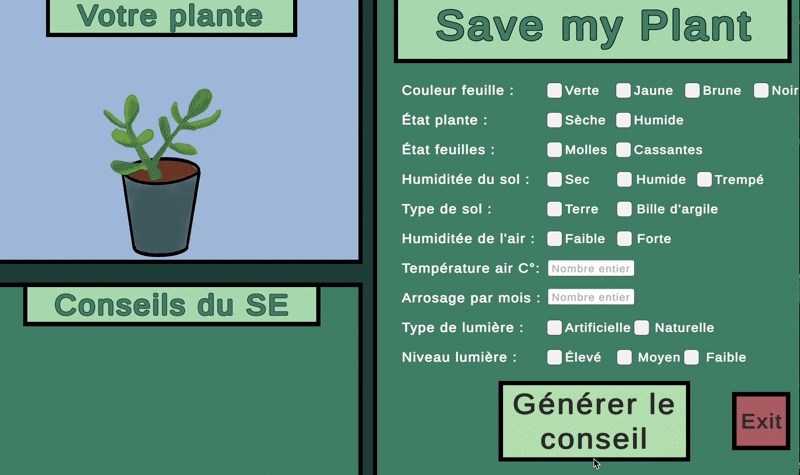

# Save-My-Plant-AI-Expert-System
**Save My Plant** is an expert system designed to help beginners with the diagnosis of health issues in succulent plants and provide solutions. This project combines symbolic artificial intelligence with a user-friendly graphic interface developed in C# using Unity. 

## Project Demo

# This project was divided into two components : 

**Inference Lisp Engine and Knowledge Base :** The Inference Engine supports both **forward chaining** (diagnosing symptoms) and **backwards chaining** (verifying advice). The Knowledge Base is a structured database of 33 logic rules using information like watering frequency, temperature, light levels, and soil types.

**Interactive graphic interface:** The Lisp interface was not very user-friendly, so I decided to implement a dynamic interface where 27 hand-drawn illustrations adapt in real-time to represent the plant based on the user’s input.

# Main features 
**Multi-factor diagnosis :** The Lisp Engine takes all the user input into consideration and updates its fact base throughout the process.

**Inference Logic:** Handles numerical comparison (e.g., Temperature > 25°C) and logical operators (AND/OR) to deduce causes like "Over-watering" or "Heat Stress".

**Advice:** To help the user, the Expert System provides actionable solutions such as "Reduce Watering", "Change Environment”, or "Immediate Indoor Relocation".

## Documentation 
For a deeper dive into this project’s functioning and code, you can read the full report here :
**[Final Report (PDF)](Rapport-Save-My-Plant-AI-Expert-System-Samuel-BLIARD.pdf)**

---
*Developed as part of the IA01 course at Université de Technologie de Compiègne (UTC).*
